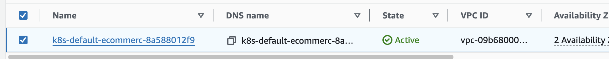
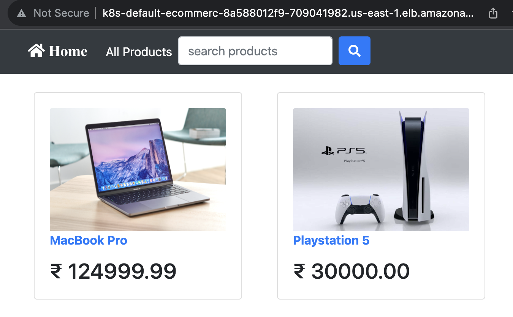
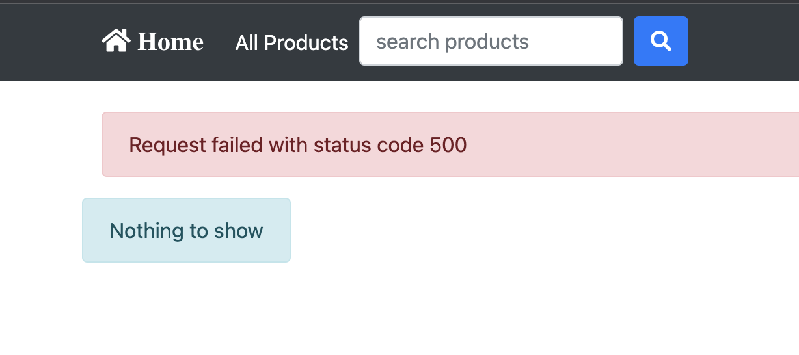

<p align="center">

</p>
<h1 align="center">Eks_Ecommerce_app<h1> 

# Planning:


# Group Members & Roles:

- Annie Lam - Data Ops engineer
- Kevin Edmond - System administrator
- Sameen Khan - Chief Architect
- Jorge Molina - Project Manager

# Purpose:

The purpose of this deployment was to be able to successfully deploy an e-commerce application using Kubernetes. In order to achieve this, we used tools such as Terraform, Jenkins, Docker, and AWS EKS.

# Steps
### Terraform (Sameen)
Terraform is a tool that helps you create and manage your infrastructure. It allows you to define the desired state of your infrastructure in a configuration file, and then Terraform takes care of provisioning and managing the resources to match that configuration. This makes it easier to automate and scale your infrastructure and ensures that it remains consistent and predictable.

### Jenkins Agent Infrastructure (Sameen)
Use Terraform to spin up the Jenkins Agent Infrastructure and to include the installs needed for the Jenkins manager instance, the install needed for the Jenkins Docker agent instance, and the install needed for the Jenkins Kubernetes agent instance.

Terraform was also utilized to launch a separate infrastructure Kubernetes infrastructure (main infrastructure). The infrastructure consisted of a VPC, 2 public subnets, and 2 private subnets each within their own availability zone (us-east-1a and us-east-1b). An internet gateway as well as a NAT gateway were also configured. 

Preparing the Jenkins Kubernetes agent instance 
The user data script which ran upon initialization of the instance was responsible for installing EKS, Kubectl, AWSCLI, and the default-jre dependency. 

This instance was utilized in manually installing the cluster. To create the cluster the following command was used:

``eksctl create cluster cluster01  --vpc-private-subnets="your-subnets"  --vpc-public-subnets="your-subnets"--without-nodegroup``

“Your-subnets” was replaced with the subnet id of the respective private and public subnets from the main infrastructure and are separated by commas. 

After the cluster was successfully created, the following command was run to create two t2.medium nodes.

``eksctl create nodegroup --cluster cluster02 --node-private-networking --node-type t2.medium --nodes 2``

### Configuring ALB Controller
The ALB controller is configured within the Jenkins Kubernetes agent instance. 

1. In order to configure the ALB Controller,  it is necessary to first add OpenID connect to the cluster.
Enter this command to add OpenID to the cluster:

``eksctl utils associate-iam-oidc-provider --cluster cluster04 --approve``

Then to make sure that the OpenID is connected to the cluster, run the following command:

``aws iam list-open-id-connect-providers``

2. Next step is to navigate to AWS website, under the VPC tab, select subnets. Add an additional tag to the subnets utilized in the main infrastructure. The key will be “kubernetes.io/role/elb” and the value will be “1” 

3. Next download the IAM policy with the following command below:

`` wget https://raw.githubusercontent.com/kura-labs-org/Template/main/iam_policy.json ``

The iam_policy.json will be downloaded 

4. Next, create the AWS policy with the following command. Once it is created the output of the created policy will display the ARN. Copy and paste that ARN as it will be used in a future command. If the policy already exists, navigate to AWS and under the IAM roles tab, search for the existing policy called “AWSLoadBalancerControllerIAMPolicy”. Copy and paste the ARN associated with the policy.

5. Next create the service account. Be sure to add the name of your cluster and attach-policy-arn values copied in the previous step:

``` eksctl create iamserviceaccount \
--cluster=cluster04 \
--namespace=kube-system \
--name=aws-load-balancer-controller \
--attach-policy-arn=arn:aws:iam::266686430719:policy/AWSLoadBalancerControllerIAMPolicy \
--override-existing-serviceaccounts \
--approve
```

6. Next create certificate manager for the ingress controller with the following command:

```
kubectl apply \
--validate=false \
-f https://github.com/jetstack/cert-manager/releases/download/v1.5.4/cert-manager.yaml
```

7. In this step, the load balancer controller is created by downloading and running the following commands:

``wget https://github.com/kubernetes-sigs/aws-load-balancer-controller/releases/download/v2.4.5/v2_4_5_full.yaml``

This command downloaded a file called “v2_4_5_full.yaml”. Within this file replace {cluster-name=your-cluster-name} with the cluster name on line 731. 

After the changes to the file have been made, run the following command to apply the file. 

``kubectl apply -f v2_4_5_full.yaml``

After this, the following command can be utilized to view the controller:

``kubectl get deployment -n kube-system aws-load-balancer-controller``


8. Last step is to run the following command:

``kubectl apply -k "github.com/aws/eks-charts/stable/aws-load-balancer-controller/crds”``

After this the ingressClass.yml can be ran 

### Install Cloudwatch Agent on AWS EKS

1. To install the Amazon EKS cloud watch agent add-on, first add the CloudWatchAgentServerPolicy to your worker nodes. Run the following command to do so:

```
aws iam attach-role-policy \
--role-name my-worker-node-role \
--policy-arn arn:aws:iam::aws:policy/CloudWatchAgentServerPolicy
```

“My-worker-node-role” must be replaced with the IAM role used by the Kubernetes worker nodes which can be found on AWS.

2. Last step is to enter the following command to install the add-on:

``aws eks create-addon --cluster-name my-cluster-name --addon-name amazon-cloudwatch-observability``

# DockerFiles:

To begin we need to build our Docker container images using the Dockerfiles stored in our repo. The first stage of the pipeline clones our Github repo to gather the source files needed for deployment. The Jenkins pipeline stage `Build` performs a docker build using the docker files, dockerfile.be and dockerfile.fe. These represent how our backend and frontend container images should be built. The `docker build` is run using the `-f` option to specify the dockerfile and the `-t` option to tag the images with a specific name. Next, we proceed to the `Login` pipeline stage to connect to our Docker Hub repository using stored credentials in the Jenkins management console. Now, in pipeline stage `Push`, we’re ready to use our Docker hub connection to push our newly created or updated docker images. Once pushed, the container images are ready to be consumed by our Kubernetes cluster.

# EKS:

In order to manage our application containers we are going to implement Kubernetes, a container orchestration platform. For our deployment, we’ll be using AWS EKS, a managed Kubernetes service with AWS. Our EKS cluster and infrastructure has already been deployed by our Chief Architect using. To deploy our application into the Kubernetes cluster we have set up several pipeline stages to apply our Kubernetes yaml files to the environment. The pipeline steps are:

- `Backend App Deployment : deployment_be.yaml`: This file creates the backend application container.
- `Frontend App Deployment`: This file creates the frontend application container.
- `Deploy App Services`: This file creates a `Cluster IP` for internal connections to the backend container and a `NodePort` service for connections to our frontend containers.  
- `Deploy Ingress`: This file creates an ingress resource that allows external HTTP traffic to reach our frontend `NodePort` server via `Application Load Balancer`.

When the pipeline completes, an Application Load Balancer becomes available supplying us with a DNS address to allow user interaction with our application.

DNS: `http://k8s-default-ecommerc-8a588012f9-709041982.us-east-1.elb.amazonaws.com/`
<br>
<br>
<br>

# DATA PIPELINE, MANAGEMENT AND ANALYSIS:
Data plays a crucial role in informing business decisions. In the context of our e-commerce application, the database employed is SQLite3. To derive meaningful insights, a systematic approach of Extracting, Transforming, and Loading (ETL) the data is undertaken. The raw data is extracted from the application and loaded into Jupyter Lab for further processing.

Understanding the data is paramount. The database schema, accessible [here](data_engineer/ecommerce_data_schema.drawio.png), serves as a blueprint for comprehending how different tables interconnect. Prior to transformation, [queries are executed](D9_queries.ipynb) to scrutinize the tables for duplicate entries, null values, and other data anomalies that necessitate cleaning.

Once the data nuances are grasped, the subsequent step involves cleaning the data and generating views from it. It's imperative to note that modifications to the original tables should only be made with explicit approval to maintain data integrity. Subsequently, the data undergoes analysis to uncover valuable insights. The culmination of this process involves translating these insights into actionable visualizations, as demonstrated in the [data_engineer/Revenue Analysis](Revenue_Analysis.pdf) report.

# Issues:

`Error - "Request failed with status code 500"`: After deploying the application successfully the first time, we encountered this error on the homepage. Initially, the error was thought to be a permissions error since the frontend containers logs showed some scp permissions errors. However, the scp policies govern our AWS accounts within an AWS Organization; our account should have adequate permissions for resources.

`Solution`: Upon further review of the frontend application’s package.json file I noticed that the application is attempting to connect to `http://backservice:8000`. I had to modify the service.yaml file’s `backendservice` name to reflect `backservice`.
<br>
<br>


# Optimization:

Our current setup for the backend application container is not optimized for a seamless and user-friendly interaction. Deploying more than one backend container would cause our user data to become out of sync with each container hosting its own database store. Moreover, lost data is an issue if the container is terminated due to its ephemeral storage use. These issues can be resolved by configuring some or all worker nodes to use persistent volumes. With persistent volumes the participating nodes can make data housed in a central data store available to running containers. Containers can connect to these persistent volumes using a persistent volume claim (PVC). PVC’s setup the request for persistent volume storage access using various configurations. Containers requiring persistent storage can be managed using stateful sets rather than a deployment which can manage the create and delete process for PVCs for its workload.
